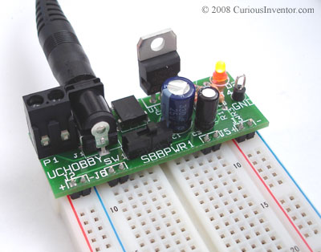
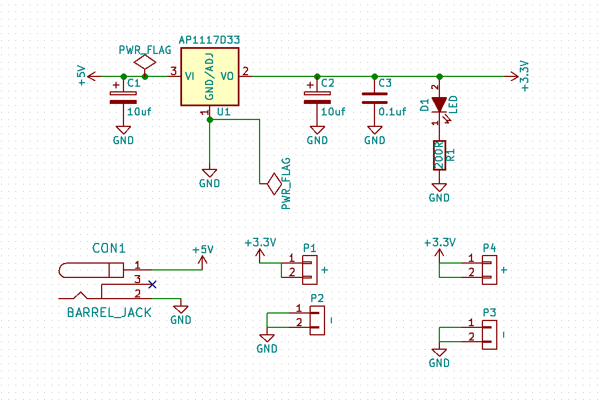
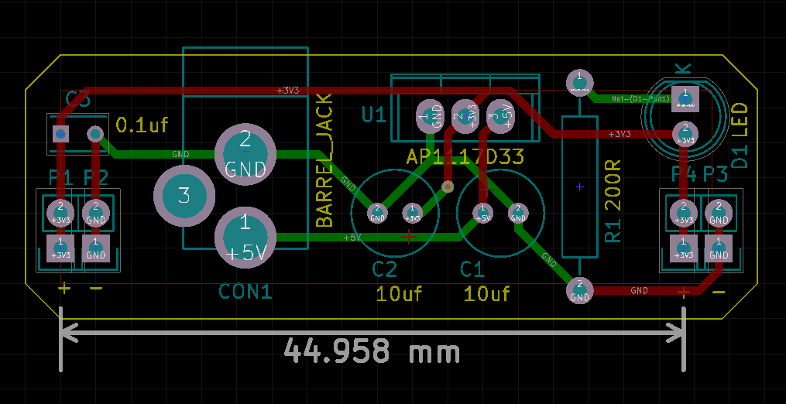

# KiCad workshop handout

The documentation for this workshop mostly consists of youtube screencasts. The
screencasts are deliberately fast, if you need them slower then click the video's settings button and choose a slower speed.

You are advised to watch the screencasts all the way through before starting,
then reference them as needed.

Each screencast has a table of contents with timings. Click the 'more' link to
expose it.

The screencasts show the creation of a simple LED board - you will be making a breadboard power supply to supply either 3.3v or 5v.

## Useful links

* Shortlink to this doc: ven.nz/kicad-ws
* [All the screencasts](https://www.youtube.com/playlist?list=PLmcDgdDpcaPjIBy60y22XzG036ckQI7bC)

# Drawing the Schematic

[Watch the schematic creation screencast](https://www.youtube.com/watch?v=SAGcpGdsB4c&index=1&list=PLmcDgdDpcaPjIBy60y22XzG036ckQI7bC)

Your first task is to produce the schematic below.
If you want a 3.3v output use part AP1117D33. If you want 5v then use LM7805CT.

## Tips

* Don't bother naming components, that will happen automatically
* The regulator footprint is in the power_integrations library
* Use the hot keys below!

## Hot Keys

* ? - show hotkeys
* e - edit component
* m - move component (without wires)
* g - drag component (with wires)
* r - rotate
* a - add component
* del - delete component
* w - start a wire
* c - copy
* l - lable a wire (wires with the same label are joined)

## Adding a library

The barrel jack's PCB footprint will not be fabricated properly because
OSHPark's fab don't do thin slots. You'll use a different footprint that's made
with large holes.

Download the [barrel jack's modified footprint library](https://github.com/mattvenn/kicad/raw/master/breadboard-psu/barrel.zip)

Footprint libraries are a directory containing 1 or more footprint
files. The directory name ends in .pretty. The footprint files end in
.kicad_mod.

[Watch the adding footprint library screencast](https://youtu.be/gfC7R_rTocs?list=PLmcDgdDpcaPjIBy60y22XzG036ckQI7bC&t=165)

* open Eschema, run CvPCB to associate footprints
* preferences -> footprint libraries
* either project specific or global tab
* add the path to the library directory (ends in .pretty) ensure its type is kicad
* scroll down the list of libraries and click the new barrel library
* highlight the barrel jack component in the middle column and double click the
 new footprint on the right column.

# Create the PCB

[Watch the PCB creation screencast](https://www.youtube.com/watch?v=t0hJgYAWNFI&index=2&list=PLmcDgdDpcaPjIBy60y22XzG036ckQI7bC)

Example layout of the PCB:

## Tips

* Some operations are easier in default canvas (F9), others in OpenGL (F11)
* Use the hot keys below!

## Kot Keys

* ? - show hotkeys
* space - reset local co-ordinates
* F1 - zoom in
* F2 - zoom out
* m - move component (without wires)
* g - drag component (with wires)
* del - delete an object
* F11 - switch to openGL view (necessary for push'n'shove routing)
* e - routing options (only in openGL)
* x - start routing
* pg up - route on top layer
* pg down - route on bottom layer
* v - create via
* f - flip a component between top & bottom layers

# Fabrication

[Watch the fabrication screencast](https://www.youtube.com/watch?v=VwQu3Ap_2rI&index=5&list=PLmcDgdDpcaPjIBy60y22XzG036ckQI7bC)

## Description of layers

* F.Cu - top copper layer used for electrical connections
* B.Cu - bottom copper layer (as above)
* F.SilkS - top silk screen used for component markings and orientation
* B.SilkS - bottom silk screen (as above)
* F.Mask - top mask used to cover the electrical connections with a nonconductive coloured layer
* B.Mask - bottom mask (as above)
* Edge.Cuts - where the board should be cut out

Each of these layers is exported as a separate file called a gerber.

You also need a drill file that specifies where all the holes are.
