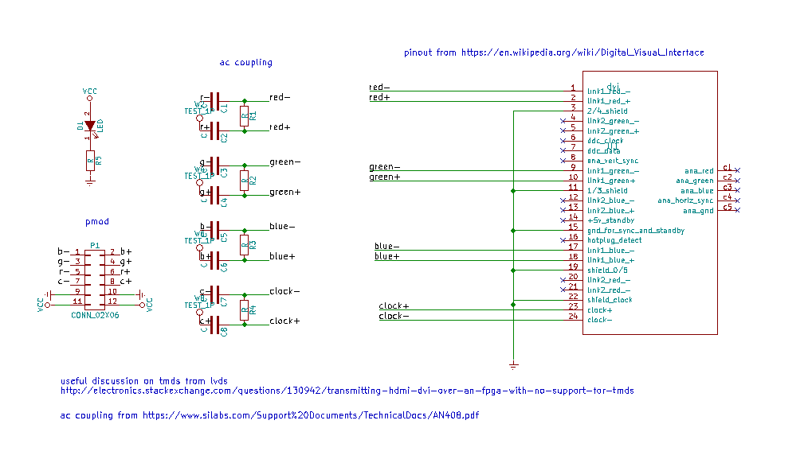
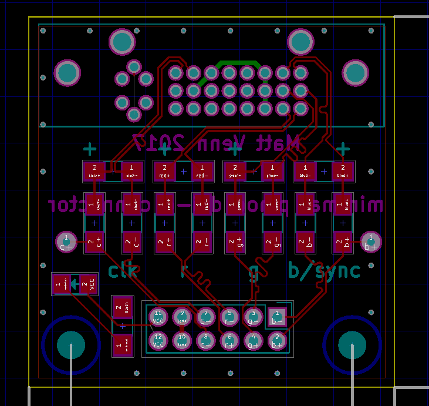

# Minimal PMOD to DVI-D adapter

For FPGAs with no TMDS, trying to use AC coupled LVDS.
AC coupling suggested in this discussion:

http://electronics.stackexchange.com/questions/130942/transmitting-hdmi-dvi-over-an-fpga-with-no-support-for-tmds

# Status

* tested pattern at 640 x 480 @ 60Hz
* total pixels is 800 x 525 @ 60Hz = 25.2Mhz = 39.6ns

[pictures](https://goo.gl/photos/ScRRi142sbwstPGr6)

# Schematic

# Board

# Todo

* too close trace to g resistor, bridged when soldering

