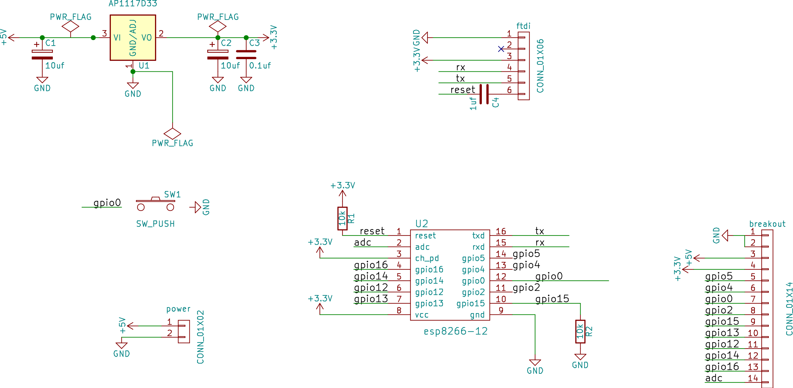

# KiCad workshop handout

## Useful links

* shortlink to this doc: TODO
* [all the screencasts](https://www.youtube.com/playlist?list=PLmcDgdDpcaPjIBy60y22XzG036ckQI7bC)

## Drawing the Schematic

[screencast](https://www.youtube.com/watch?v=SAGcpGdsB4c&index=1&list=PLmcDgdDpcaPjIBy60y22XzG036ckQI7bC)

### Using the ESP8266 library

Download the [ESP8266 symbol and footpring libraries](https://github.com/mattvenn/kicad-esp8266-lib/archive/master.zip)

Symbol libraries are single files that end in .lib. They can contain 1 or many
symbols.

Footprint librarys are files within a directory. The directory name ends in
.pretty. The files end in .kicad_mod. Each file contains a separate footprint

### Add the ESP8266 symbol library to Eschema

* open eschema
* prefs -> component libs
* add component library _file_ (not path)
* find lib just created and double click it
* now should be able to search for symbol when adding new symbols

### Hot Keys

* ? - show hotkeys
* e - edit component
* g - move
* r - rotate
* a - add component
* del - delete component
* w - start a wire
* c - copy
* l - lable a wire (wires with the same label are joined)

## Create PCB

[screencast](https://www.youtube.com/watch?v=t0hJgYAWNFI&index=2&list=PLmcDgdDpcaPjIBy60y22XzG036ckQI7bC)

### Add ESP8266 library to Pcbnew

* open Pcbnew
* preferences -> footprint library manager
* either project specific or global tab
* add the path to the library directory (ends in .pretty) ensure its type is kicad

### Kot Keys

* ? - show hotkeys
* space - reset local co-ordinates
* f1 - zoom in
* f2 - zoom out
* del - delete component
* f11 - switch to openGL view (necessary for push'n'shove routing)
* e - routing options (only in openGL)
* x - start routing
* pg up - route on top layer
* pg down - route on bottom layer
* v - create via
* f - flip a component between top & bottom layers
