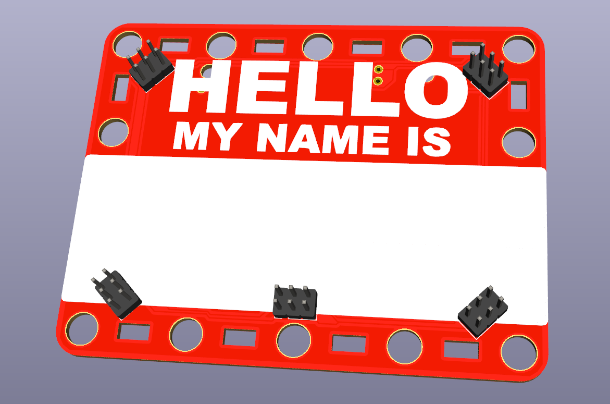
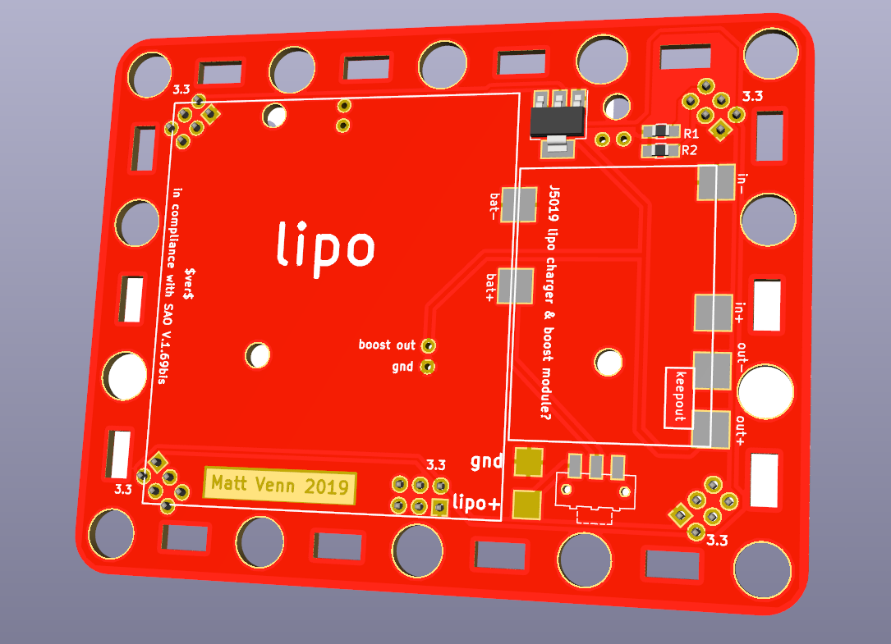

# OOBB compatible SAO V.1.69bis name badge

* compatible with OOBB https://github.com/oomlout/oomlout-OOBB/wiki/pictureIndex
* 5 x [SAO V.1.69bis](https://hackaday.com/2019/03/20/introducing-the-shitty-add-on-v1-69bis-standard/) 6 pin connectors - GPIO1&2 shared across all connectors. I2C not connected
* pads for LiPo battery and USB charger
* 90x70mm $5 USD from https://pcbway.com
* [iCEBreaker](https://www.crowdsupply.com/1bitsquared/icebreaker-fpga) compatible. Red and Green LED output drive GPIO1&2 on all SAOs.

# BOM

* J5019 LiPo booster incorporating [TC4056A](docs/TC4056A.pdf) LiPo charger
* LiPo battery measuring 46x52mm
* 3.3v regulator [LD1117S33TR](https://uk.farnell.com/stmicroelectronics/ld1117s33tr/v-reg-ldo-3-3v-smd-1117-sot-223/dp/1202826)
* 2 x 10k pullup resistors if using iCEBreaker to control GPIOs
* sliding SMT switch [JS102012SAQN](https://uk.farnell.com/c-k-components/js102011saqn/switch-spdt-0-6a-6vdc-side-smd/dp/2320017)
* 5 x female 2x3 pin header with 2.54mm spacing, eg this [Pololu part](https://www.pololu.com/product/1023)

